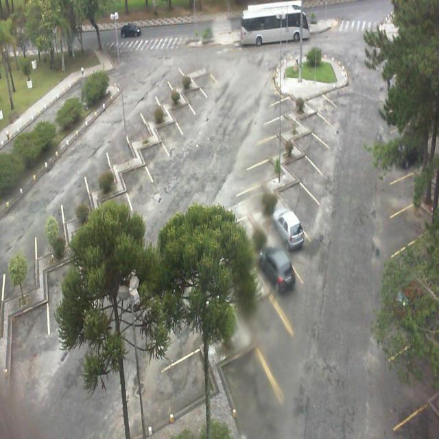

# 
YOLO Parking Spot detection model

## 
Models

## Overview
This repository hosts a YOLO-based Parking Spot Detection Model aimed at real-time detection of available parking spots using drone and CCTV footage. The model has been trained and fine-tuned using YOLOv8, a state-of-the-art object detection algorithm, and optimized for real-time applications in urban environments.

Author: **Asiri Dhananjaya** | [LinkedIn](https://www.linkedin.com/in/asiri-bandara/) | [Github](https://github.com/Black-randy) |

##  YOLO 
YOLO (You Only Look Once) is an advanced object detection algorithm designed for real-time applications due to its exceptional speed and accuracy. In this project, we trained models using YOLOv8n.
br>

 

Detection (COCO)

See [Detection Docs](https://docs.ultralytics.com/tasks/detect/) for usage examples with these models trained on [COCO](https://docs.ultralytics.com/datasets/detect/coco/), which include 80 pre-trained classes.

| Model                                                                                | size (pixels) | mAPval 50-95 | Speed CPU ONNX (ms) | Speed A100 TensorRT (ms) | params (M) | FLOPs (B) |
| ------------------------------------------------------------------------------------ | --------------------- | -------------------- | ------------------------------ | ----------------------------------- | ------------------ | ----------------- |
| [YOLOv8n](https://github.com/ultralytics/assets/releases/download/v8.2.0/yolov8n.pt) | 640                   | 37.3                 | 80.4                           | 0.99                                | 3.2                | 8.7               |
| [YOLOv8s](https://github.com/ultralytics/assets/releases/download/v8.2.0/yolov8s.pt) | 640                   | 44.9                 | 128.4                          | 1.20                                | 11.2               | 28.6              |
| [YOLOv8m](https://github.com/ultralytics/assets/releases/download/v8.2.0/yolov8m.pt) | 640                   | 50.2                 | 234.7                          | 1.83                                | 25.9               | 78.9              |
| [YOLOv8l](https://github.com/ultralytics/assets/releases/download/v8.2.0/yolov8l.pt) | 640                   | 52.9                 | 375.2                          | 2.39                                | 43.7               | 165.2             |
| [YOLOv8x](https://github.com/ultralytics/assets/releases/download/v8.2.0/yolov8x.pt) | 640                   | 53.9                 | 479.1                          | 3.53                                | 68.2               | 257.8             |

- **mAPval** values are for single-model single-scale on [COCO val2017](https://cocodataset.org/) dataset.  Reproduce by `yolo val detect data=coco.yaml device=0`
- **Speed** averaged over COCO val images using an [Amazon EC2 P4d](https://aws.amazon.com/ec2/instance-types/p4/) instance.  Reproduce by `yolo val detect data=coco.yaml batch=1 device=0|cpu`

 

## 
 Model Training 

The [yolov8n_plp_100e models](/models/) were trained using the [PKLot Dataset](https://www.kaggle.com/datasets/blanderbuss/parking-lot-dataset), which contains over 695,000 labeled images of parking spaces captured under various weather conditions (sunny, overcast, rainy). 

---

#### PKLot Dataset
The [PKLot Dataset](https://www.kaggle.com/datasets/blanderbuss/parking-lot-dataset) consists of 695,899 images of parking spaces, labeled as vacant or occupied. The dataset includes images taken under sunny, overcast, and rainy conditions, allowing the model to generalize well to different lighting and weather scenarios. This real-world dataset is ideal for testing parking space detection models.

---

## System Architecture

The system architecture involves real-time video feed processing from strategically placed cameras (CCTV) or drone footage to detect parking spaces. The YOLO model identifies available spots, processes the images, and sends real-time notifications via a mobile application.

Key features:
- **Real-time object detection**: Continuous monitoring of parking lots with high-definition cameras or drones.
- **Mobile integration**: User-friendly interface with real-time notifications of available parking spaces.

---

## Results

The model was trained on a GPU with a training time of over 8 hours, yielding impressive real-time detection results. Below are sample outputs of the model, showing before and after applying the YOLO model to detect vacant parking spots:

| Input Image                           | Output Image                         |
|---------------------------------------|--------------------------------------|
|  |  |

---

## License

This project is licensed under the **MIT License**. Feel free to use, modify, and distribute the code and models for personal and commercial projects, as long as the original author is credited.

---

For more details, visit the original repository: [AI Spot Detection](https://github.com/Black-randy/AI_spot_detect).

---